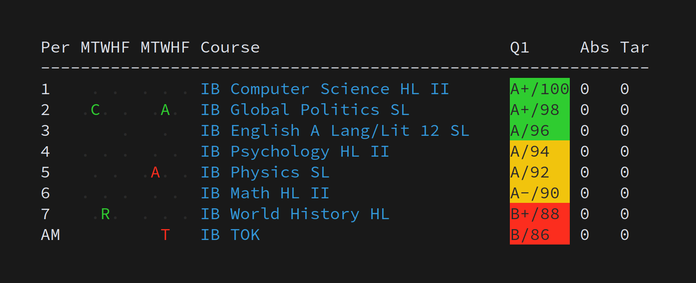

# `psc` for PowerSchool
> A minimal command-line tool for reading grades from [PowerSchool](https://www.powerschool.com/).


_Disclaimer: not my actual grades or attendance record._

## Installation
From the `psc` directory, run:
```sh
make install
```
for a full installation.

Alternatively, if you're working on `psc` in a development environment, you may wish to symlink the executable for ease of testing:
```sh
make link
```
To uninstall:
```sh
make uninstall
```
Any of these commands may require root privileges depending on your environment.

To cleanup credentials located at root (you should run after uninstall):

`make purge`

## Use
To view all grades:
```sh
psc
```
To view grade and task list for a specific class and marking period (not fully implemented yet):
```sh
psc -p 3 -m Q1
```

## Configuration
At first run, your PowerSchool credentials will be requested and saved to `~/.psc_credentials.yml`. Other configuration options will populate `~/.psc.yml`, and may be tweaked as desired.

## License
[MIT](LICENSE)

## Author
[Erik Boesen](https://github.com/ErikBoesen)
